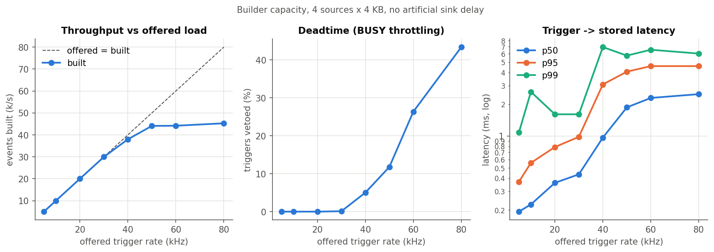
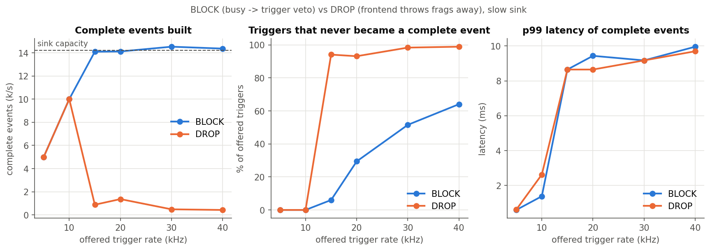
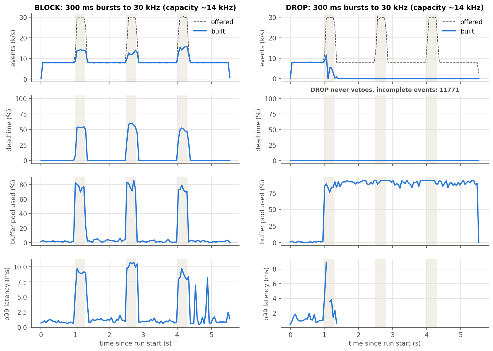
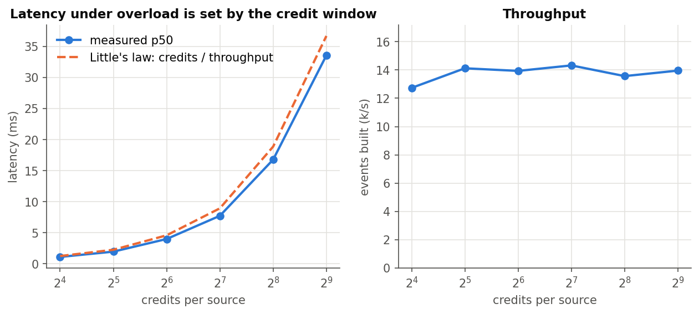
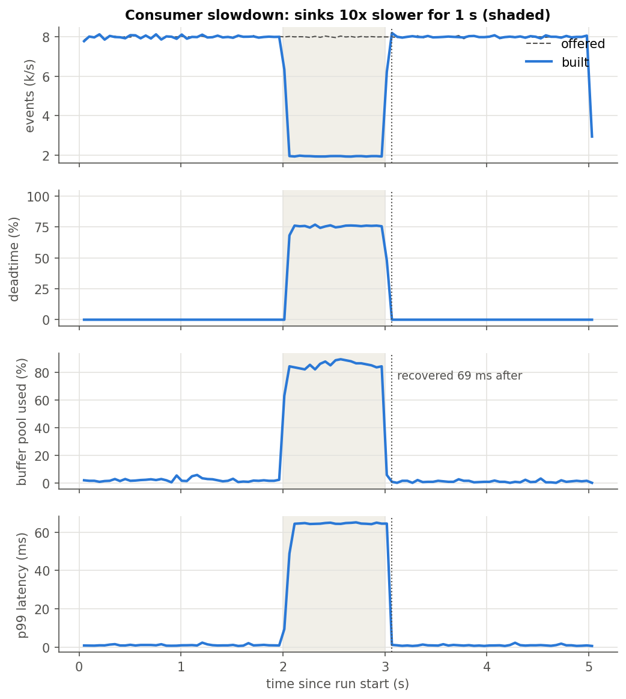
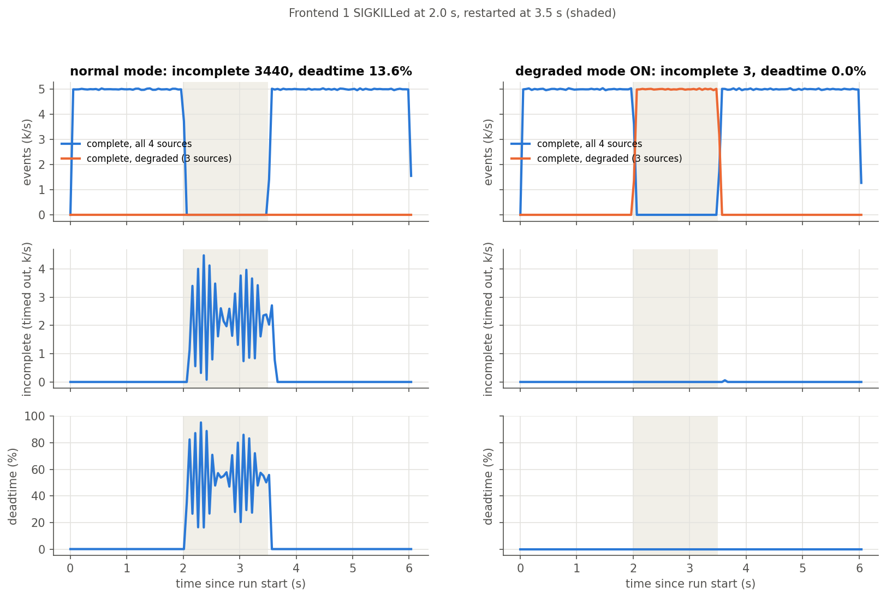
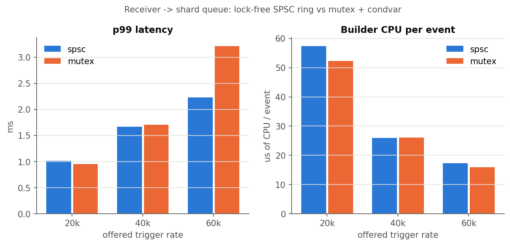

# EventForge

A high-throughput **DAQ event builder with explicit backpressure**, written in C++20 for Linux.
It is modelled on the data acquisition chain of a particle physics experiment: several detector
frontends read out fragments of the same collision ("event"), and an event builder has to put the
pieces back together, at rate, without losing track of anything, and behave predictably when
something downstream can't keep up.

Everything runs on one machine: frontends are separate processes, the builder is one process with a
thread pipeline, and Python is only used to launch experiments and plot results.

```
                     TTC shared memory (trigger + BUSY)
            +---------------------------------------------------+
            |                                                   v
  frontend 0 --+                                    +--> shard 0 --+
  frontend 1 --+--TCP--> receiver (epoll) --SPSC----+              +--> done queue --> sink x M
  frontend N --+  <-------- credits ----------------+--> shard K --+                       |
                     ^                                                                    |
                     +-------------------- buffer slots + credits released <--------------+
```

## What it does

- **Event building**: fragments are matched by `eventId` across all sources in sharded assemblers
  (`eventId % shards`, one thread each, no locks on the event map). Incomplete events time out.
- **Central trigger with BUSY throttling**: a trigger generator writes triggers into a shared memory
  segment that every frontend reads (like the LHC TTC system). A frontend that can't keep up raises a
  BUSY bit and the trigger is **vetoed**. Vetoed triggers are counted as **deadtime**.
- **Credit based flow control**: each frontend may only have `credits` fragments in flight. Credits
  come back when the builder is done with a fragment, so memory and latency are bounded end to end.
- **Two overload policies** to compare: `BLOCK` (raise BUSY and wait, nothing is lost) and `DROP`
  (throw fragments away at the frontend, no deadtime).
- **Bounded everything**: preallocated buffer pool for payloads, bounded SPSC rings and queues
  between threads. No unbounded buffering anywhere.
- **Fault injection**: transit loss, duplicates, reordering, payload corruption (CRC32C), frontend
  crash (`_exit` or SIGKILL from the orchestrator), frontend restart mid-run, stuck frontend,
  consumer slowdown, trigger bursts.
- **Exact accounting**: every injected fault is classified and counted by the builder (seq gap vs
  source drop vs duplicate vs reorder vs CRC error), and the tests check the numbers match exactly.
- **Degraded mode**: when a source dies, events can complete without it instead of timing out.
- **Observability**: per-thread counters on their own cache lines, log-linear latency histograms,
  a sampler writing `metrics.jsonl` every 50 to 100 ms, per-thread CPU from `/proc`.

## Results

All numbers below are from a **2 vCPU cloud VM** (Xeon @ 2.1 GHz) running the builder, 4 frontends
and the trigger on the same two cores, with 4 KB fragments. They will be different on your machine,
`make bench` regenerates everything.

| | |
|---|---|
| Baseline (4 sources, 10 kHz, 4 KB) | 50,000 / 50,000 events complete, every payload byte verified, p50 188 µs, p99 573 µs trigger to stored |
| Builder capacity | **45k events/s, ~740 MB/s** of payload before BUSY starts vetoing triggers |
| Overload, BLOCK | throughput stays at sink capacity (14k/s), **0 incomplete events**, overload turns into deadtime |
| Overload, DROP | throughput **collapses to 0.4k to 1.4k events/s**, 93 to 99% of triggers never become a complete event |
| Bursts to 2x capacity | BLOCK recovers **60 to 140 ms** after each burst. DROP **never recovers** (see below) |
| Consumer 10x slower for 1 s | 0 events lost, deadtime 75% during the slowdown, recovered **~70 ms** after |
| Producer killed for 1.5 s | normal mode: 3,440 incomplete + 13.6% deadtime. degraded mode: **3 incomplete, 0% deadtime** |
| Fault accounting | injected loss / dup / reorder / corrupt counted **exactly** by the builder (table below) |

### Throughput and latency vs load


### BLOCK vs DROP under overload


DROP looks attractive (no deadtime) but it collapses. Each frontend drops on its own, so different
sources keep fragments for *different* events. Those partial events then sit in the builder until the
timeout, holding buffers and credits, so the sources run out of credits again and drop more. Almost
no event ever gets all its fragments. This is the reason real DAQ systems throttle the trigger
centrally (BUSY) instead of letting each readout board drop data.

### Bursts: BLOCK recovers, DROP is metastable


With DROP the system stays collapsed even after the load is back **below** capacity (8 kHz vs 14 kHz
capacity). Once the sources are out of step nothing pulls them back in step. BLOCK goes back to
normal in 60 to 140 ms after every burst.

### Latency is set by the credit window (Little's law)


Under overload the queueing delay is `in flight / throughput`, and the credit window is what caps
"in flight". Measured p50 follows `credits / throughput` from 16 to 512 credits, throughput stays
flat. So the credit size is a direct latency knob.

### Consumer slowdown and producer failure



### Fault accounting (faults.yaml)

| fault | injected by frontend | counted by builder | builder counter |
|---|---|---|---|
| loss (src 0) | 100 | 100 | `net_transit_loss` |
| dup (src 1) | 111 | 111 | `duplicates` |
| reorder (src 2) | 99 | 99 | `reordered` |
| corrupt (src 3) | 34 | 34 | `crc_errors` |
| incomplete events | 134 | 134 | `events_incomplete` (= loss + corrupt) |

### Lock-free SPSC vs mutex queue


Honest result: at these rates the receiver to shard queue is not the bottleneck, so the lock-free
ring doesn't win. The SPSC consumer has no condvar and has to poll with backoff, which costs a bit
of latency at low rate, and on 2 cores both variants spend most of their CPU in syscalls, memcpy and
CRC. The ring only starts to matter when the queue itself is hot.

## Build and run

Linux only (epoll, futex, `/dev/shm`). GCC 12+ or Clang 15+, CMake 3.20+.
GoogleTest is used from the system if present, otherwise fetched by CMake.

```sh
cmake -S . -B build
cmake --build build -j
./build/unit_tests && ./build/e2e_tests
```

On a Mac, use the Dockerfile:

```sh
docker build -t eventforge .
docker run --rm -it -v "$PWD/results:/src/results" -v "$PWD/docs:/src/docs" eventforge
# inside: make test, make bench ...
```

Run one experiment, then plot:

```sh
pip install pyyaml matplotlib
python3 experiments/run.py experiments/scenarios/overload.yaml
python3 analysis/plot.py            # results/ -> docs/img/*.png
```

Or by hand:

```sh
./build/daq_builder --sources 2 --rate 10000 --duration-s 5 --metrics-out m.jsonl &
./build/daq_frontend --source-id 0 &
./build/daq_frontend --source-id 1 --loss 0.01
```

The builder prints a JSON summary on stdout at the end of the run.

### Main knobs

| builder | |
|---|---|
| `--sources N` | number of frontends (max 64) |
| `--rate HZ` / `--rate-profile "t:hz,..."` | trigger rate, or a piecewise rate for bursts |
| `--credits N` | fragments in flight per source |
| `--shards K` / `--sinks M` | assembler / sink threads |
| `--queue spsc\|mutex` | receiver to shard queue type |
| `--timeout-ms` | incomplete event timeout |
| `--degraded` | complete events without dead sources |
| `--sink-delay-us`, `--slow-at-s/--slow-for-s/--slow-delay-us` | sink cost, consumer slowdown fault |
| `--verify` | check every payload byte at the sink |

| frontend | |
|---|---|
| `--policy block\|drop` | what to do without credits |
| `--payload-min/--payload-max` | fragment size range |
| `--derand N` | local buffer depth before raising BUSY |
| `--loss --dup --reorder --corrupt P` | fault probabilities |
| `--die-at-s T`, `--stall-at-s T --stall-for-s D` | crash / freeze at time T |

## Experiments

| scenario | what it shows |
|---|---|
| `baseline` | sanity, everything complete and verified |
| `rate_sweep` | builder capacity, latency vs load, where BUSY kicks in |
| `overload` | BLOCK vs DROP with a slow consumer |
| `credits` | latency vs credit window (Little's law) |
| `burst` | bursts above capacity, recovery time |
| `slow_consumer` | sinks 10x slower for 1 s |
| `producer_failure` | frontend SIGKILL + restart, normal vs degraded mode |
| `faults` | exact accounting of every fault type |
| `queue_compare` | SPSC ring vs mutex queue |

## Repo layout

```
include/daq/      wire format, crc32c, histogram, queues, buffer pool, TTC shared memory, metrics
src/common/       implementations of the above
src/frontend/     frontend process: trigger input + BUSY, fault injector, main loop
src/builder/      receiver, shards (assembler + sweeper), sinks, trigger generator, main
tests/            unit tests + end to end tests that run the real binaries
experiments/      run.py + scenario yaml files
analysis/         plot.py
docs/             architecture.md, plots
```

More detail: [docs/architecture.md](docs/architecture.md) for how it works, [NOTES.md](NOTES.md)
for the design decisions and tradeoffs.

## Not in scope

Multi-node deployment, retransmission (lost fragments are counted, never recovered), persistent
storage, consensus. The builder is a single process, the "network" is loopback TCP.
