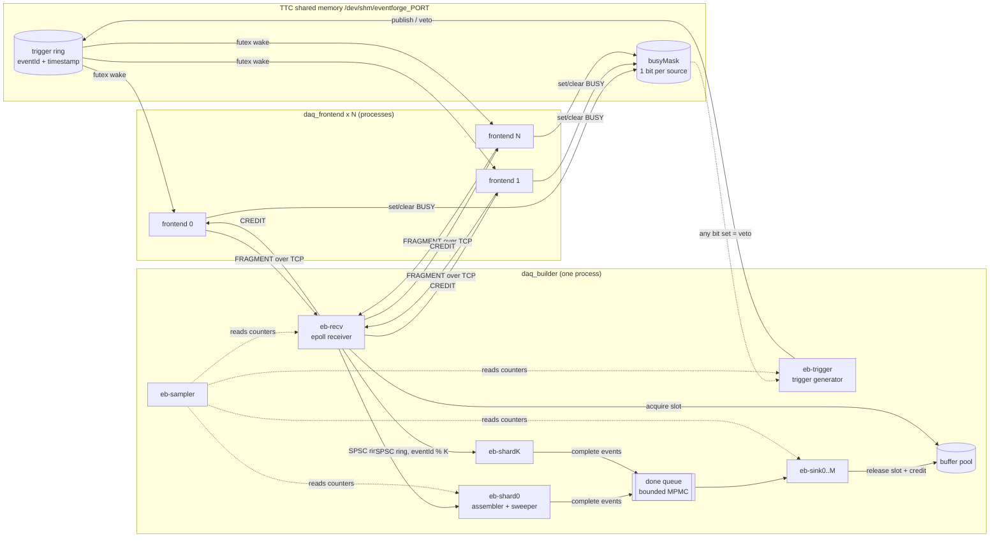

# Architecture

## Processes and threads



| thread | job |
|---|---|
| `eb-trigger` | issues triggers at the configured rate into the TTC ring, vetoes when any BUSY bit is set |
| `eb-recv` | epoll over all frontend sockets, framing, seq tracking, CRC, payload into pool slot, push to shard, send credits |
| `eb-shardN` | owns one `Assembler` (no locks), completes events, sweeps timeouts, degraded completion |
| `eb-sinkN` | "stores" events (configurable delay, optional byte check), records latency, frees slots + credits |
| `eb-sampler` | every 50 to 100 ms writes one line of `metrics.jsonl` |

## Life of a fragment

1. Trigger generator publishes trigger `n` with timestamp `t_n` into the TTC ring and wakes the frontends (futex).
2. Each frontend reads trigger `n`, builds a fragment (deterministic payload from `(sourceId, n)`, CRC32C), checks its credits.
   - credit left: assign `seq`, send.
   - no credit + BLOCK: set BUSY bit, wait for a CREDIT message. New triggers are vetoed meanwhile.
   - no credit + DROP: throw it away, no `seq` assigned.
3. Receiver frames the TCP stream, takes a slot from the buffer pool (none free = stop reading this socket, TCP pushes back), runs the `SourceTracker` (gap / reorder / duplicate / source skip), checks the CRC, copies the payload into the slot and pushes a small `Fragment` (header + slot index) to shard `n % K`.
4. Shard adds it to the partial event. When all required sources are present the event goes to the done queue. That push **blocks** when the sinks are behind.
5. Sink processes the event, records `commit time - t_n` as end to end latency, releases every slot. Each release adds one credit back for that source.
6. Receiver sees `released + credits > last grant` and sends a cumulative CREDIT message.

## Backpressure chain

```
sinks slow -> done queue full -> shards block on push -> fragments stay in pool slots
-> credits not released -> frontends run out of credits
   -> BLOCK: BUSY -> trigger vetoed (deadtime), nothing lost, latency capped by credits
   -> DROP:  fragments dropped at the frontend, incomplete events, no deadtime
```

Every buffer on the way is bounded:

| buffer | bound |
|---|---|
| frontend backlog | `--derand` triggers, then BUSY (BLOCK only) |
| in flight per source | `--credits` fragments |
| buffer pool | `sources * (credits + 8)` slots, allocated once |
| shard inbox | sized to the pool, so it can never be the one that fills |
| done queue | `--done-cap` events |
| TTC ring | 65536 triggers, a frontend that lags more loses triggers (counted as overruns) |

## Wire format

Every message is a 16 byte header + body, little endian, encoded with `memcpy`.

| offset | size | header field |
|---|---|---|
| 0 | 4 | magic `DAQF` |
| 4 | 1 | version (1) |
| 5 | 1 | type: HELLO 1, FRAGMENT 2, CREDIT 3, BYE 4, START 5 |
| 6 | 2 | reserved (0) |
| 8 | 4 | body length (max 1 MiB) |
| 12 | 4 | reserved (0) |

| message | body |
|---|---|
| HELLO (fe -> eb) | sourceId u16, pad u16, pid u32 |
| START (eb -> fe) | t0 u64, initial credit limit u64 |
| FRAGMENT (fe -> eb) | eventId u64, triggerTs u64, sendTs u64, sourceId u16, flags u16, seq u32, payloadLen u32, payloadCrc u32, then payload |
| CREDIT (eb -> fe) | cumulative credit limit u64 (frontend may send while `sent < limit`) |
| BYE (fe -> eb) | fragments sent on this connection u64 |

A bad header (wrong magic / version / type / length) closes the connection, there is no attempt to resync a broken stream.

## Loss classification

`seq` is assigned only to fragments that go on the wire (or get "lost" by the fault injector after
being given a seq). `eventId` comes from the trigger. That makes the cases separable:

| what the builder sees | meaning |
|---|---|
| `seq` jumps ahead | lost in transit (provisional) |
| `seq` below expected, not seen before | reordered, fills an earlier hole |
| `seq` below expected, seen before | duplicate, dropped in the receiver |
| `eventId` jumps further than `seq` | frontend dropped events before sending (DROP policy) |
| CRC mismatch | corrupted payload, dropped |
| fragment for an event already finished | late |
| connection closed without BYE | producer failure |

## Failure handling

- **Producer crash**: the receiver sees EOF without BYE, counts a producer failure, removes the source
  from the live mask and clears its BUSY bit (otherwise the trigger would stay vetoed forever).
- **Degraded mode** (`--degraded`): the required mask becomes `all sources & live sources`, and the
  sweeper completes events that were only waiting for the dead source.
- **Restart**: a restarted frontend says HELLO again, gets a new connection generation (fragments of
  the old connection still in the pipeline no longer count for its credits), and joins at the current
  trigger.
- **Stuck frontend / consumer slowdown / bursts**: handled by the normal backpressure chain, measured
  by the sampler.

## Wakeups and timing

Nothing on the data path waits on a timer:

| who waits | for what | how |
|---|---|---|
| frontend | next trigger | futex on `wakeSeq` in the TTC segment (shared, cross process) |
| frontend (BLOCK) | credit | `poll()` on its socket |
| receiver | data / credits ready | epoll on the sockets + an eventfd the sinks write once per credit batch |
| shard | fragment | SPSC: futex on `pushSeq` (producer wakes only if `sleeping`), mutex queue: condvar |
| sink | event | condvar of the done queue |

Only the trigger generator and the sink's simulated storage delay are paced by time. They use
`preciseSleepUntil()`: nanosleep most of the way, spin the last part. How much to spin is
measured at startup (`calibrateSpin()`), because inside a VM on a Mac a 100 µs sleep can
take 2-3 ms. The summary reports `sleep_overshoot_us`, `spin_us` and `crc32c_impl`.

## Metrics (`metrics.jsonl`, one line per sample)

`t`, `trig_rate`, `veto_rate`, `deadtime`, `ev_rate`, `mb_rate`, `frag_rate`, `lat_p50_us`,
`lat_p99_us`, `lat_max_us` (events finished in that interval), `inbox_sum`, `inbox_max`, `done_q`,
`pool_used`, `pool_frac`, `partials`, `complete`, `incomplete`, `degraded`, `src_skips`, `seq_gaps`,
`crc_errors`, `dups`, `producer_failures`, `busy_sources`, `live_sources`, `shard_blocked_ms`, `cpu_pct`.
